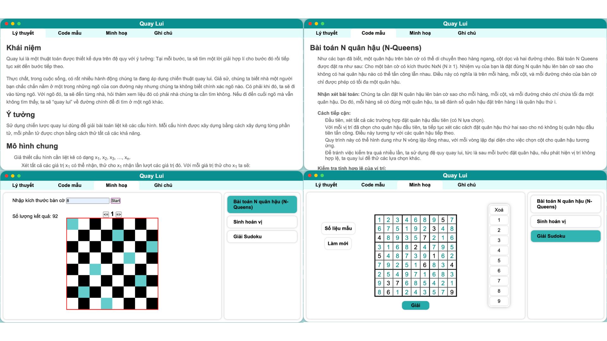

# Project ALGORYTHM
Dự án này mang đến những kiến thức nền tảng về các thuật toán cơ bản trong môn Cấu trúc dữ liệu và Giải thuật (DS-A), bao gồm khái niệm,, ý tưởng, mô hình chung, ứng dụng, ví dụ minh họa, cùng với hình ảnh trực quan cho từng thuật toán.
## Cấu Trúc Dự Án
- **Trang Chính**: Gồm 6 thẻ tương ứng với 6 thuật toán.
  
  

- **Trang Chi Tiết**: Khi nhấn vào 1 thẻ, trang chi tiết hiện lên với 3 tùy chọn: Lý thuyết, Ví dụ, Hình ảnh minh họa cho từng ví dụ.
  
  
## Công Nghệ Sử Dụng
- **Frontend**: HTML, CSS, JavaScript
- **Backend**:
